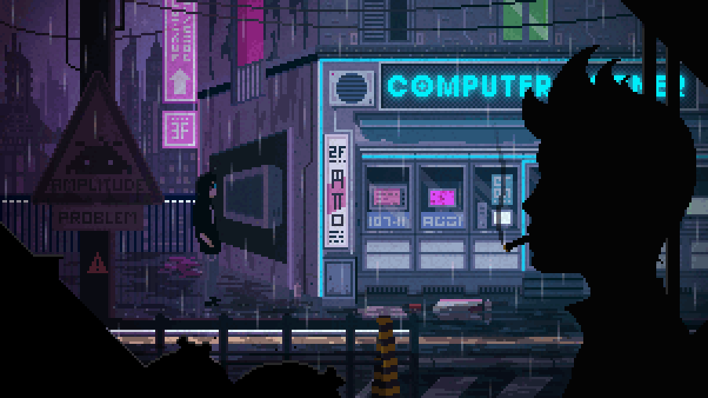

  <!--  -->

  <h1>Dmytro Tsvetkov</h1>
  <h3>Frontend-Focused Full-Stack Developer</h3>

  

    I build fast, maintainable web products with <strong>React</strong>, <strong>Next.js</strong>, and <strong>WordPress/PHP</strong>.
  

  

    
    
    
  

  

    
    
    
    
    
    
  

## About

- Frontend-Focused Full-Stack Developer with 3+ years of experience
- Building modern React interfaces, reusable UI systems, and scalable front-end architecture
- Strong in performance, UX, and API-driven product features
- WordPress/PHP background for custom integrations and back-end support

## Stack

`React` `Next.js` `TypeScript` `JavaScript` `Redux` `SCSS` `Tailwind CSS` `Jest` `RTL` `Cypress` `WordPress` `PHP` `REST API` `Git`

## Focus

- Modern front-end architecture
- Reusable components and design systems
- Performance optimization and Web Vitals
- Complex forms, dashboards, and API-driven interfaces

## Selected Work

- React component libraries and reusable UI systems
- Complex forms and checkout flows with advanced validation
- Divi + React front-end integrations
- Custom API-driven features for WordPress products

---

  Open to Frontend and Frontend-Focused Full-Stack opportunities.

